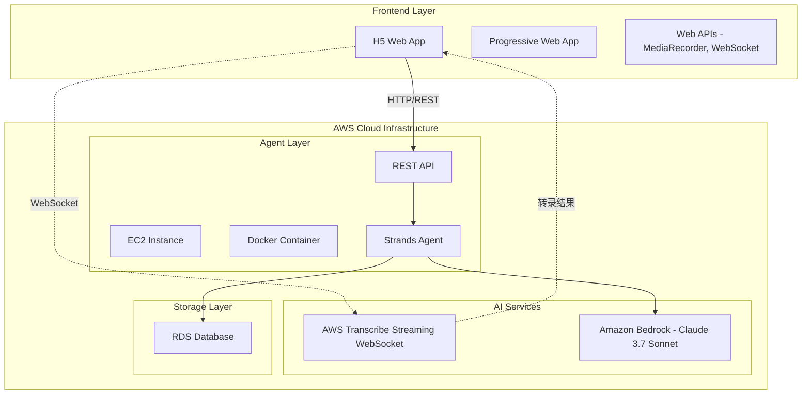
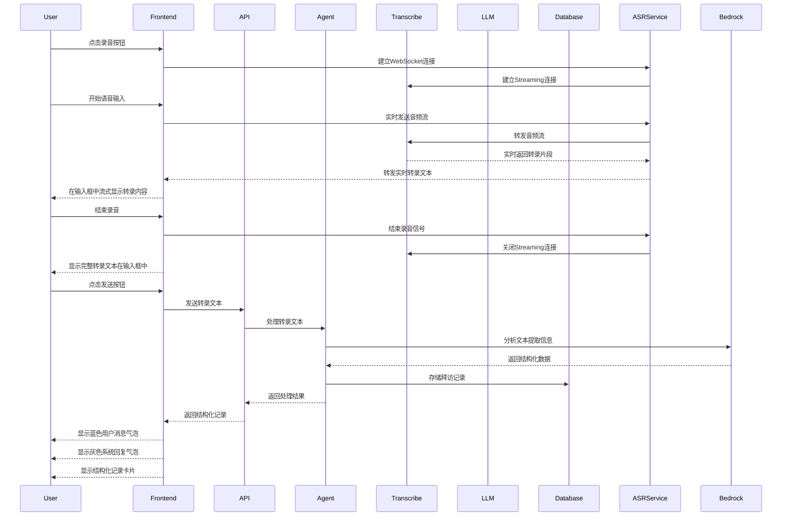

# Design Document

## Overview

药代拜访医生语音备忘录Agent是一个基于AWS云服务的智能语音处理系统，采用前后端分离架构。前端使用H5技术构建跨平台的移动端Web应用，支持PWA特性，后端基于Strands Agent框架提供语音识别、自然语言处理和数据管理服务。系统通过AWS Transcribe进行语音转文本，使用LLM进行意图识别和信息提取，将非结构化的语音输入转换为结构化的拜访记录数据。

## Architecture

### System Architecture



### Data Flow



## Components and Interfaces

### Frontend Components (H5技术栈)

#### 1. 技术选择
- **核心技术**: React + TypeScript
- **UI组件库**: shadcn/ui (基于Radix UI + Tailwind CSS)
- **构建工具**: Vite
- **PWA支持**: Service Worker + Web App Manifest
- **状态管理**: React Context / Zustand

#### 2. Main Application Component (React)
- **职责**: 应用主控制器，管理全局状态
- **技术实现**: 
  - React Context或Zustand进行状态管理
  - shadcn/ui组件进行UI构建
  - Tailwind CSS响应式设计适配移动端

#### 3. Visit Card Component (shadcn/ui)
- **职责**: 展示和编辑单个拜访记录
- **技术实现**:
  - 使用shadcn/ui的Card、Badge、Button组件
  - Tailwind CSS实现响应式布局
  - Framer Motion实现展开/收起动画
  - 标签颜色通过Tailwind CSS类管理

#### 4. Audio Recording Module (React Hook)
- **职责**: 处理语音录制和与ASR服务通信
- **技术实现**:
  - 自定义React Hook封装录音逻辑
  - shadcn/ui的Button组件作为录音按钮
  - 使用Web APIs进行音频处理
- **Web APIs**:
  - `MediaRecorder API`: 录音功能
  - `getUserMedia API`: 麦克风权限
  - `Web Audio API`: 音频处理和可视化
  - `WebSocket API`: 连接ASR服务
  - `AudioContext`: 音频格式转换（PCM 16kHz）

#### 5. Message Display Component (shadcn/ui)
- **职责**: 显示对话消息
- **技术实现**:
  - 使用shadcn/ui的ScrollArea组件
  - 自定义消息气泡组件
  - Tailwind CSS实现响应式设计
  - React Virtualized优化长列表性能

### Backend Components

#### 1. Strands Agent Core
```python
from strands import Agent, tool
from strands.models import BedrockModel

# 使用默认的Claude 3.7 Sonnet模型
agent = Agent(
    name="pharma-visit-memo-agent",
    description="智能药代拜访记录助手",
    # 默认使用 Amazon Bedrock Claude 3.7 Sonnet
    # model="us.anthropic.claude-3-7-sonnet-20250219-v1:0"
)

# 或者显式配置Bedrock模型
bedrock_model = BedrockModel(
    model_id="us.anthropic.claude-3-7-sonnet-20250219-v1:0",
    region_name='us-east-1',
    temperature=0.3,
)
agent = Agent(
    name="pharma-visit-memo-agent", 
    model=bedrock_model
)
```

#### 2. Python Backend Services
- **技术栈**: Python + FastAPI
- **依赖管理**: uv (Python包管理器)
- **功能**:
  - 接收前端发送的转录文本
  - 调用Strands Agent处理文本
  - 返回结构化结果给前端
  - 管理用户会话和状态

#### 3. Strands Agent Integration (Python)
- **技术**: Python + Strands Agent框架
- **依赖管理**: uv管理Python包
- **输入来源**: 前端发送的转录文本
- **触发方式**: 前端通过FastAPI调用Agent
- **职责**: 
  - 接收前端发送的文本作为用户输入
  - 执行NLP处理和信息提取
  - 管理对话状态和上下文
  - 调用Amazon Bedrock Claude进行意图识别
  - 执行数据库操作
- **对Transcribe无感知**: Agent只处理文本，不知道文本来源是语音转录

#### 3. NLP Processing Service
- **职责**: 自然语言理解和信息提取
- **功能**:
  - 意图识别（增删改查）
  - 实体提取（时间、医生、药品）
  - 观念分类匹配

#### 4. Concept Matching Service
- **职责**: 医生观念智能分类
- **预定义类别**:
  - 药物优势认知
  - 用药顾虑
  - 疗效期待
  - 成本考虑
  - 依从性关注
  - 安全性重视

#### 5. Database Service
- **职责**: 数据持久化和查询
- **技术**: AWS RDS (PostgreSQL)
- **功能**:
  - CRUD操作
  - 复杂查询支持
  - 数据备份和恢复

## Data Models

### Visit Record Model
```typescript
interface VisitRecord {
  id: string;
  visitTime: Date;
  doctorName: string;
  drugName: string;
  doctorTreatmentView: string;  // 医生对该药品的治疗观念描述
  treatmentAttitude: TreatmentAttitude;  // 治疗观念层级分类
  notes: string;
  createdAt: Date;
  updatedAt: Date;
  userId: string;
}

enum TreatmentAttitude {
  UNAWARE = "不了解",
  AWARE_NOT_ACCEPTING = "有听说但不认可", 
  TRIALIST = "尝试过但依从性低",
  ADOPTER = "常规使用",
  ADVOCATE = "重度使用/积极推荐者"
}
```

### Message Model
```typescript
interface Message {
  id: string;
  type: 'user' | 'agent';
  text: string;
  timestamp: string;
  cards?: VisitRecord[];
  audioUrl?: string;
}
```

### User Session Model
```typescript
interface UserSession {
  sessionId: string;
  userId: string;
  startTime: Date;
  lastActivity: Date;
  context: {
    currentIntent?: string;
    pendingRecords?: Partial<VisitRecord>[];
  };
}
```

## Error Handling

### Frontend Error Handling
1. **网络错误**: 显示重试机制和离线提示
2. **录音权限错误**: 引导用户授权麦克风权限
3. **文件上传错误**: 提供文件大小和格式检查
4. **数据验证错误**: 实时表单验证和错误提示

### Backend Error Handling
1. **Transcribe Streaming服务错误**: 
   - WebSocket连接断开重连机制
   - 音频缓冲区管理（防止数据丢失）
   - 流式连接超时处理
   - 降级到批量转录模式
   - 错误日志记录和监控

2. **Bedrock Claude处理错误**:
   - 模型调用超时处理
   - Bedrock服务限流处理
   - 回退到规则基础提取
   - 部分信息保存机制

3. **数据库错误**:
   - 连接池管理
   - 事务回滚
   - 数据一致性检查

### Error Response Format
```typescript
interface ErrorResponse {
  error: {
    code: string;
    message: string;
    details?: any;
    timestamp: Date;
  };
  requestId: string;
}
```

## Testing Strategy

### Frontend Testing (H5)
1. **单元测试**: Jest + jsdom
   - DOM操作测试
   - 用户交互测试
   - 状态管理测试
   - Web API模拟测试

2. **集成测试**: Playwright / Cypress
   - 端到端用户流程
   - 移动端设备模拟
   - PWA功能测试
   - 跨浏览器兼容性

3. **移动端测试**: 
   - 真机测试（iOS Safari, Android Chrome）
   - 响应式设计测试
   - 触摸交互测试
   - 网络状况测试（3G/4G/WiFi）

4. **可访问性测试**: axe-core
   - 键盘导航
   - 屏幕阅读器支持
   - 颜色对比度检查

### Backend Testing
1. **单元测试**: pytest
   - Agent工具函数测试
   - 数据模型验证测试
   - 业务逻辑测试

2. **集成测试**: 
   - AWS服务集成测试
   - 数据库操作测试
   - 第三方API测试

3. **性能测试**: 
   - 并发用户负载测试
   - 音频处理性能测试
   - 数据库查询优化测试

### Test Data Management
```typescript
interface TestDataSet {
  audioSamples: {
    singleVisit: string[];
    multipleVisits: string[];
    ambiguousInput: string[];
    noiseBackground: string[];
  };
  expectedExtractions: {
    [audioFile: string]: VisitRecord[];
  };
}
```

## Deployment Architecture

### AWS Infrastructure
1. **EC2 Instance**: 
   - Instance Type: t3.medium (可根据负载调整)
   - Auto Scaling Group配置
   - Security Groups配置

2. **Docker Configuration**:
   - Multi-stage build优化
   - 健康检查配置
   - 环境变量管理

3. **Load Balancer**:
   - Application Load Balancer
   - SSL/TLS终止
   - 健康检查配置

4. **Database**:
   - RDS PostgreSQL
   - Multi-AZ部署
   - 自动备份配置

### CI/CD Pipeline
```yaml
stages:
  - build
  - test
  - security-scan
  - deploy-staging
  - integration-test
  - deploy-production
```

## Security Considerations

### Data Protection
1. **音频数据加密**: S3服务端加密
2. **传输加密**: HTTPS/TLS 1.3
3. **数据库加密**: RDS加密存储
4. **API认证**: JWT token + API密钥

### Privacy Compliance
1. **数据最小化**: 只收集必要信息
2. **数据保留**: 自动删除过期记录
3. **用户同意**: 明确的隐私政策
4. **数据导出**: 支持用户数据导出

### Access Control
1. **用户认证**: 多因素认证支持
2. **API限流**: 防止滥用
3. **审计日志**: 完整的操作记录
4. **权限管理**: 基于角色的访问控制
## H5技术优势


### 跨平台兼容性
1. **一次开发，多端运行**: 支持iOS、Android、桌面浏览器
2. **无需应用商店审核**: 快速迭代和部署
3. **自动更新**: 用户始终使用最新版本
4. **降低开发成本**: 无需维护多个原生应用

### PWA特性支持
1. **离线功能**: Service Worker缓存关键资源
2. **添加到主屏幕**: 类似原生应用的体验
3. **推送通知**: 支持消息推送（如需要）
4. **后台同步**: 网络恢复时自动同步数据

### 移动端优化
1. **响应式设计**: 适配各种屏幕尺寸
2. **触摸友好**: 优化触摸交互体验
3. **性能优化**: 
   - 懒加载
   - 代码分割
   - 资源压缩
   - CDN加速

### Web APIs集成
1. **MediaRecorder API**: 原生录音功能
2. **Geolocation API**: 位置信息（如需要）
3. **Vibration API**: 触觉反馈
4. **Web Share API**: 分享功能

## 技术实现细节

### 实时录音和流式转录实现
```javascript
class StreamingAudioRecorder {
  constructor(websocketUrl) {
    this.websocket = null;
    this.audioContext = null;
    this.mediaStream = null;
    this.processor = null;
    this.websocketUrl = websocketUrl;
  }
  
  async startStreaming() {
    // 建立WebSocket连接
    this.websocket = new WebSocket(this.websocketUrl);
    
    // 获取麦克风权限
    this.mediaStream = await navigator.mediaDevices.getUserMedia({ 
      audio: {
        sampleRate: 16000,
        channelCount: 1,
        echoCancellation: true,
        noiseSuppression: true
      }
    });
    
    // 创建音频上下文
    this.audioContext = new AudioContext({ sampleRate: 16000 });
    const source = this.audioContext.createMediaStreamSource(this.mediaStream);
    
    // 创建音频处理器
    this.processor = this.audioContext.createScriptProcessor(4096, 1, 1);
    
    this.processor.onaudioprocess = (event) => {
      const inputBuffer = event.inputBuffer;
      const inputData = inputBuffer.getChannelData(0);
      
      // 转换为PCM16格式
      const pcmData = this.convertToPCM16(inputData);
      
      // 通过WebSocket发送音频数据
      if (this.websocket.readyState === WebSocket.OPEN) {
        this.websocket.send(pcmData);
      }
    };
    
    source.connect(this.processor);
    this.processor.connect(this.audioContext.destination);
    
    // 监听转录结果
    this.websocket.onmessage = (event) => {
      const transcription = JSON.parse(event.data);
      this.onTranscriptionReceived(transcription);
    };
  }
  
  convertToPCM16(float32Array) {
    const buffer = new ArrayBuffer(float32Array.length * 2);
    const view = new DataView(buffer);
    let offset = 0;
    
    for (let i = 0; i < float32Array.length; i++, offset += 2) {
      const s = Math.max(-1, Math.min(1, float32Array[i]));
      view.setInt16(offset, s < 0 ? s * 0x8000 : s * 0x7FFF, true);
    }
    
    return buffer;
  }
  
  stopStreaming() {
    if (this.processor) {
      this.processor.disconnect();
    }
    if (this.mediaStream) {
      this.mediaStream.getTracks().forEach(track => track.stop());
    }
    if (this.websocket) {
      this.websocket.close();
    }
  }
  
  onTranscriptionReceived(transcription) {
    // 处理实时转录结果
    if (transcription.isPartial) {
      this.updatePartialTranscription(transcription.text);
    } else {
      this.addFinalTranscription(transcription.text);
    }
  }
}
```

### AWS Transcribe Streaming集成
```python
# 前端直接连接AWS Transcribe Streaming
class DirectTranscribeRecorder {
  constructor() {
    this.transcribeWebSocket = null;
    this.audioContext = null;
    this.mediaStream = null;
    this.processor = null;
  }
  
  async startTranscription() {
    // 直接建立与AWS Transcribe的WebSocket连接
    const transcribeUrl = await this.getTranscribeWebSocketUrl();
    this.transcribeWebSocket = new WebSocket(transcribeUrl);
    
    // 获取麦克风权限
    this.mediaStream = await navigator.mediaDevices.getUserMedia({ 
      audio: {
        sampleRate: 16000,
        channelCount: 1,
        echoCancellation: true,
        noiseSuppression: true
      }
    });
    
    // 创建音频上下文
    this.audioContext = new AudioContext({ sampleRate: 16000 });
    const source = this.audioContext.createMediaStreamSource(this.mediaStream);
    
    // 创建音频处理器
    this.processor = this.audioContext.createScriptProcessor(4096, 1, 1);
    
    this.processor.onaudioprocess = (event) => {
      const inputBuffer = event.inputBuffer;
      const inputData = inputBuffer.getChannelData(0);
      
      // 转换为PCM16格式并发送给Transcribe
      const pcmData = this.convertToPCM16(inputData);
      
      if (this.transcribeWebSocket.readyState === WebSocket.OPEN) {
        this.transcribeWebSocket.send(pcmData);
      }
    };
    
    source.connect(this.processor);
    this.processor.connect(this.audioContext.destination);
    
    // 监听Transcribe转录结果
    this.transcribeWebSocket.onmessage = (event) => {
      const transcription = JSON.parse(event.data);
      this.handleTranscriptionResult(transcription);
    };
  }
  
  async getTranscribeWebSocketUrl() {
    // 使用AWS SDK生成预签名的WebSocket URL
    // 或通过后端API获取预签名URL
    const response = await fetch('/api/transcribe/websocket-url');
    const { url } = await response.json();
    return url;
  }
  
  handleTranscriptionResult(transcription) {
    // 实时显示转录结果
    if (transcription.isPartial) {
      this.updatePartialTranscription(transcription.text);
    } else {
      this.addFinalTranscription(transcription.text);
      // 收集完整转录文本，准备发送给Agent
      this.completeTranscriptions.push(transcription.text);
    }
  }
  
  async finishRecording() {
    // 关闭WebSocket连接
    if (this.transcribeWebSocket) {
      this.transcribeWebSocket.close();
    }
    
    // 停止音频流
    if (this.mediaStream) {
      this.mediaStream.getTracks().forEach(track => track.stop());
    }
    
    // 发送完整转录文本给Strands Agent
    const fullText = this.completeTranscriptions.join(' ');
    await this.sendToAgent(fullText);
  }
  
  async sendToAgent(text) {
    // 通过REST API发送给Strands Agent
    const response = await fetch('/api/agent/process', {
      method: 'POST',
      headers: { 'Content-Type': 'application/json' },
      body: JSON.stringify({ text })
    });
    
    const result = await response.json();
    this.displayStructuredResult(result);
  }
}

# 后端REST API - 简化版本
from fastapi import FastAPI
from strands import Agent, tool

app = FastAPI()
agent = PharmaVisitAgent()

@app.post("/api/agent/process")
async def process_transcription(request: dict):
    text = request.get('text', '')
    result = await agent.process(text)
    return result

@app.get("/api/transcribe/websocket-url")
async def get_transcribe_websocket_url():
    # 生成AWS Transcribe Streaming的预签名WebSocket URL
    # 使用AWS SDK和临时凭证
    url = generate_transcribe_websocket_url()
    return {"url": url}

from strands import Agent, tool
from strands.models import BedrockModel

class PharmaVisitAgent(Agent):
    def __init__(self):
        # 使用默认的Claude 3.7 Sonnet，Strands已经配置好Bedrock集成
        super().__init__(
            name="pharma-visit-memo-agent",
            description="智能药代拜访记录助手"
        )
    
    async def process(self, text: str):
        """处理转录文本"""
        extracted_info = await self.extract_visit_information(text)
        
        if extracted_info:
            record_id = await self.store_visit_record(extracted_info)
            return {'success': True, 'record_id': record_id, 'data': extracted_info}
        
        return {'success': False, 'message': '未能提取有效信息'}
    
    @tool
    async def extract_visit_information(self, text: str):
        """从转录文本中提取拜访信息
        
        使用Claude 3.7 Sonnet分析转录文本，提取：
        - 拜访时间
        - 医生姓名  
        - 讨论的药品名称
        - 医生对该药品的治疗观念层级
        """
        prompt = f"""
        请分析以下药代拜访转录文本，提取结构化信息：
        
        转录文本：{text}
        
        请提取以下信息并以JSON格式返回：
        {{
            "visit_time": "拜访时间",
            "doctor_name": "医生姓名", 
            "drug_name": "药品名称",
            "doctor_treatment_view": "医生对该药品的治疗观念描述原文",
            "treatment_attitude": "治疗观念层级（从预定义类别中选择最匹配的）"
        }}
        
        预定义治疗观念层级：
        - 不了解：没听说过该治疗方案/产品，不清楚适应症、机制、证据
        - 有听说但不认可：听过产品/机制，但认为"证据不够""安全性存疑""没看到优势"，可能有固有偏见或依赖传统治疗
        - 尝试过但依从性低：曾开过一两次，但未持续使用，反馈不佳/病人依从性差/医生自己信心不足
        - 常规使用：在部分患者中规律使用，认同其疗效/安全性，但有用药边界
        - 重度使用/积极推荐者：大量患者使用该治疗方案，会主动与同行讨论，甚至愿意做讲者/研究者
        
        请仔细分析医生的描述，选择最匹配的层级。如果描述不够明确，请选择最保守的层级。
        """
        
        # Strands Agent会自动调用Claude 3.7 Sonnet处理这个prompt
        response = await self.llm_call(prompt)
        return self.parse_json_response(response)
    
    @tool 
    async def store_visit_record(self, visit_info: dict):
        """存储拜访记录到数据库"""
        # 数据库操作逻辑
        pass
```

### PWA配置
```json
{
  "name": "药代拜访备忘录",
  "short_name": "拜访备忘",
  "description": "智能语音记录助手",
  "start_url": "/",
  "display": "standalone",
  "background_color": "#ffffff",
  "theme_color": "#3b82f6",
  "icons": [
    {
      "src": "/icons/icon-192.png",
      "sizes": "192x192",
      "type": "image/png"
    }
  ]
}
```## Amazon 
Bedrock集成优势

### Strands Agent默认集成
- **开箱即用**: Strands Agent默认使用Amazon Bedrock Claude 3.7 Sonnet
- **简化配置**: 无需复杂的API集成，Strands已经封装好所有细节
- **自动管理**: 自动处理认证、重试、错误处理等

### Claude 3.7 Sonnet特性
- **多模态支持**: 支持文本和图像输入（未来可扩展）
- **大上下文窗口**: 支持长文本分析
- **中文优化**: 对中文理解和生成有很好的支持
- **结构化输出**: 擅长生成JSON等结构化数据

### 成本和性能优化
- **按需付费**: 只为实际使用的token付费
- **高性能**: Claude 3.7 Sonnet在准确性和速度间有很好平衡
- **区域部署**: 可选择最近的AWS区域减少延迟

### 示例配置
```python
# 最简配置 - 使用默认设置
agent = Agent(name="pharma-visit-memo-agent")

# 自定义配置
from strands.models import BedrockModel

bedrock_model = BedrockModel(
    model_id="us.anthropic.claude-3-7-sonnet-20250219-v1:0",
    region_name='us-east-1',  # 选择合适的区域
    temperature=0.3,          # 控制输出随机性
    max_tokens=4000,          # 最大输出长度
)

agent = Agent(
    name="pharma-visit-memo-agent",
    model=bedrock_model
)
```## 技术栈优势


### 前端：React + shadcn/ui + Tailwind CSS
- **shadcn/ui优势**:
  - 基于Radix UI，提供无障碍访问支持
  - 完全可定制，使用Tailwind CSS样式
  - TypeScript原生支持
  - 复制粘贴式组件，无运行时依赖
  - 现代化设计系统

- **组件示例**:
```tsx
import { Button } from "@/components/ui/button"
import { Card, CardContent, CardHeader, CardTitle } from "@/components/ui/card"
import { Badge } from "@/components/ui/badge"

function VisitCard({ visit }: { visit: VisitRecord }) {
  return (
    <Card className="w-full">
      <CardHeader>
        <CardTitle className="flex items-center justify-between">
          <span>{visit.doctorName}</span>
          <Badge variant="secondary">{visit.visitTime}</Badge>
        </CardTitle>
      </CardHeader>
      <CardContent>
        <div className="flex gap-2">
          <Badge className="bg-purple-100 text-purple-800">
            {visit.drugName}
          </Badge>
          <Badge className="bg-green-100 text-green-800">
            {visit.treatmentAttitude}
          </Badge>
        </div>
      </CardContent>
    </Card>
  )
}
```

### 后端：Python + uv + FastAPI + Strands Agent
- **uv优势**:
  - 极快的Python包管理器（比pip快10-100倍）
  - 统一的项目管理工具
  - 内置虚拟环境管理
  - 兼容pip和pyproject.toml

- **项目结构示例**:
```
backend/
├── pyproject.toml          # uv项目配置
├── uv.lock                 # 锁定文件
├── src/
│   ├── main.py            # FastAPI应用入口
│   ├── agents/            # Strands Agent
│   ├── services/          # ASR服务
│   └── models/            # 数据模型
└── requirements.txt       # 兼容性依赖文件
```

- **uv命令示例**:
```bash
# 创建项目
uv init pharma-visit-backend

# 添加依赖
uv add fastapi strands-agents boto3

# 运行应用
uv run python src/main.py

# 安装开发依赖
uv add --dev pytest black
```
###
 治疗观念分类工具实现

```python
@tool
async def classify_treatment_attitude(self, doctor_treatment_view: str, drug_name: str):
    """使用Claude 3.7 Sonnet对医生治疗观念进行智能分类
    
    Args:
        doctor_treatment_view: 医生对药品的治疗观念描述
        drug_name: 药品名称
    
    Returns:
        分类结果和置信度
    """
    
    classification_prompt = f"""
    请根据以下医生治疗观念的五个层级，对医生关于"{drug_name}"的观念进行分类：

    **五个治疗观念层级：**
    
    1. **不了解** - 医生表现出对该药品完全不了解的特征：
       - 没听说过该治疗方案/产品
       - 不清楚适应症、机制、证据
       - 询问基本信息
    
    2. **有听说但不认可** - 医生知道但不接受的特征：
       - 听过产品/机制，但认为"证据不够""安全性存疑""没看到优势"
       - 可能有固有偏见或依赖传统治疗
       - 表达怀疑或担忧
    
    3. **尝试过但依从性低** - 医生有过尝试但不持续的特征：
       - 曾开过一两次，但未持续使用
       - 反馈不佳/病人依从性差/医生自己信心不足
       - 表达过去的不良体验
    
    4. **常规使用** - 医生规律使用的特征：
       - 在部分患者中规律使用
       - 认同其疗效/安全性，但有用药边界
       - 有选择性地使用
    
    5. **重度使用/积极推荐者** - 医生高度认可的特征：
       - 大量患者使用该治疗方案
       - 会主动与同行讨论，甚至愿意做讲者/研究者
       - 积极推荐给其他医生或患者

    **医生观念描述：**
    "{doctor_treatment_view}"

    请分析上述描述，返回JSON格式结果：
    {{
        "treatment_attitude": "选择的层级名称",
        "confidence": 0.95,
        "reasoning": "分类理由的简要说明",
        "key_indicators": ["关键指标1", "关键指标2"]
    }}

    注意：
    - 如果描述不够明确，请选择最保守的层级
    - confidence应该在0.6-1.0之间
    - reasoning应该解释为什么选择这个层级
    - key_indicators应该列出支持这个分类的关键词或短语
    """
    
    # 调用Claude进行分类
    response = await self.llm_call(classification_prompt)
    classification_result = self.parse_json_response(response)
    
    # 验证分类结果
    valid_attitudes = ["不了解", "有听说但不认可", "尝试过但依从性低", "常规使用", "重度使用/积极推荐者"]
    if classification_result.get("treatment_attitude") not in valid_attitudes:
        # 如果分类结果无效，使用默认值
        classification_result = {
            "treatment_attitude": "不了解",
            "confidence": 0.6,
            "reasoning": "无法明确分类，使用保守估计",
            "key_indicators": ["描述不够明确"]
        }
    
    return classification_result
```

### LLM分类的优势

1. **上下文理解**: Claude能理解复杂的医学语境和隐含意思
2. **灵活性**: 能处理各种表达方式和语言风格
3. **一致性**: 基于明确的分类标准进行判断
4. **可解释性**: 提供分类理由和关键指标
5. **自适应**: 能处理边界情况和模糊描述## St
rands Agent详细设计

### Agent系统Prompt

```python
SYSTEM_PROMPT = """
你是一个专业的药代拜访记录助手，专门帮助药代整理和管理医生拜访会议纪要。

**你的核心职责：**
1. 从药代的语音转录文本中提取结构化的拜访信息
2. 识别用户的操作意图（新增、查询、修改、删除拜访记录）
3. 对医生的治疗观念进行专业分类
4. 提供准确、结构化的数据输出

**处理原则：**
- 仔细分析转录文本，提取关键信息
- 一次输入可能包含多个拜访记录或多个操作意图
- 对于不确定的信息，标记为需要确认
- 保持专业的医药行业术语理解
- 优先处理明确的信息，对模糊信息进行合理推断

**输出格式：**
- 始终返回结构化的JSON数据
- 包含操作类型、提取的信息和置信度
- 对于治疗观念分类，提供详细的分析理由

**注意事项：**
- 医生姓名可能只有姓氏，需要保持原样记录
- 时间信息可能是相对时间（如"今天上午"），需要转换为具体时间
- 药品名称要保持准确，注意通用名和商品名的区别
- 治疗观念分类要基于五层级标准进行准确判断
"""
```

### Agent工具设计

#### 1. 主要信息提取工具

```python
@tool
async def extract_visit_information(self, text: str) -> dict:
    """从转录文本中提取拜访信息
    
    Args:
        text: 用户的语音转录文本
        
    Returns:
        包含提取信息的字典
    """
    
    extraction_prompt = f"""
    请分析以下药代拜访转录文本，提取所有拜访记录信息：
    
    转录文本："{text}"
    
    请识别以下信息并以JSON格式返回：
    {{
        "intent": "操作意图（create/query/update/delete）",
        "visits": [
            {{
                "visit_time": "拜访时间（如果是相对时间请转换为具体时间）",
                "doctor_name": "医生姓名",
                "drug_name": "药品名称",
                "doctor_treatment_view": "医生对该药品的治疗观念描述原文",
                "notes": "其他补充信息",
                "confidence": 0.95
            }}
        ],
        "total_records": 2,
        "processing_notes": "处理说明或需要用户确认的信息"
    }}
    
    **提取规则：**
    1. 时间处理：
       - "今天上午" → 当前日期 + 10:00
       - "下午2点" → 当前日期 + 14:00
       - "昨天" → 前一天日期
    
    2. 医生姓名：
       - 保持原文记录，即使只有姓氏
       - 注意职称（如"张主任"、"李医生"）
    
    3. 药品名称：
       - 保持准确的药品名称
       - 注意通用名和商品名
    
    4. 治疗观念：
       - 记录医生的原始表述
       - 包含用药频率、态度、经验等信息
    
    5. 多记录处理：
       - 识别文本中的多个拜访记录
       - 每个记录单独提取信息
    """
    
    response = await self.llm_call(extraction_prompt)
    return self.parse_json_response(response)
```

#### 2. 治疗观念分类工具

```python
@tool
async def classify_treatment_attitude(self, doctor_treatment_view: str, drug_name: str) -> dict:
    """对医生治疗观念进行五层级分类
    
    Args:
        doctor_treatment_view: 医生对药品的治疗观念描述
        drug_name: 药品名称
        
    Returns:
        分类结果和详细分析
    """
    
    classification_prompt = f"""
    请根据医生治疗观念的五个专业层级，对医生关于"{drug_name}"的观念进行精确分类：

    **医生治疗观念五层级标准：**
    
    **1. 不了解（Unaware）**
    特征指标：
    - 没听说过该治疗方案/产品
    - 不清楚适应症、机制、证据
    - 询问基本信息："这是什么药？"
    - 表达完全陌生："没用过"、"不知道"
    
    **2. 有听说但不认可（Aware but Not Accepting）**
    特征指标：
    - 听过产品/机制，但持怀疑态度
    - 认为"证据不够"、"安全性存疑"、"没看到优势"
    - 有固有偏见或依赖传统治疗
    - 表达担忧："不太相信"、"还是用老药安全"
    
    **3. 尝试过但依从性低（Trialist）**
    特征指标：
    - 曾开过一两次，但未持续使用
    - 反馈不佳/病人依从性差/医生自己信心不足
    - 表达过去的不良体验："试过几次"、"效果一般"
    - 偶尔使用但不是常规选择
    
    **4. 常规使用（Adopter）**
    特征指标：
    - 在部分患者中规律使用
    - 认同其疗效/安全性，但有用药边界
    - 有选择性地使用："适合的病人会用"
    - 表达认可但谨慎："这个药不错，但要看情况"
    
    **5. 重度使用/积极推荐者（Advocate）**
    特征指标：
    - 大量患者使用该治疗方案
    - 会主动与同行讨论，甚至愿意做讲者/研究者
    - 积极推荐给其他医生或患者
    - 表达高度认可："这是我的首选"、"经常推荐"

    **医生观念描述：**
    "{doctor_treatment_view}"

    **分析要求：**
    1. 仔细分析描述中的关键词和语气
    2. 识别医生的使用频率和态度倾向
    3. 考虑医生的专业表达习惯
    4. 如果描述模糊，选择最保守的层级

    请返回JSON格式结果：
    {{
        "treatment_attitude": "选择的层级名称",
        "confidence": 0.95,
        "reasoning": "详细的分类理由，解释为什么选择这个层级",
        "key_indicators": ["关键指标1", "关键指标2", "关键指标3"],
        "usage_frequency_clues": "从描述中推断的使用频率信息",
        "attitude_tone": "医生表达的情感倾向（积极/中性/消极）"
    }}
    """
    
    response = await self.llm_call(classification_prompt)
    classification_result = self.parse_json_response(response)
    
    # 验证和后处理
    valid_attitudes = ["不了解", "有听说但不认可", "尝试过但依从性低", "常规使用", "重度使用/积极推荐者"]
    if classification_result.get("treatment_attitude") not in valid_attitudes:
        classification_result = {
            "treatment_attitude": "不了解",
            "confidence": 0.6,
            "reasoning": "描述信息不足，无法明确分类，采用保守估计",
            "key_indicators": ["信息不明确"],
            "usage_frequency_clues": "无明确频率信息",
            "attitude_tone": "中性"
        }
    
    return classification_result
```

#### 3. 数据库操作工具

```python
@tool
async def store_visit_record(self, visit_data: dict) -> str:
    """存储拜访记录到数据库
    
    Args:
        visit_data: 包含拜访信息的字典
        
    Returns:
        记录ID
    """
    # 数据验证
    required_fields = ["visit_time", "doctor_name", "drug_name"]
    for field in required_fields:
        if not visit_data.get(field):
            raise ValueError(f"缺少必需字段: {field}")
    
    # 治疗观念分类
    if visit_data.get("doctor_treatment_view"):
        classification = await self.classify_treatment_attitude(
            visit_data["doctor_treatment_view"],
            visit_data["drug_name"]
        )
        visit_data["treatment_attitude"] = classification["treatment_attitude"]
        visit_data["classification_confidence"] = classification["confidence"]
        visit_data["classification_reasoning"] = classification["reasoning"]
    
    # 存储到数据库
    record_id = await self.database.insert_visit_record(visit_data)
    return record_id

@tool
async def query_visit_records(self, filters: dict) -> list:
    """查询拜访记录
    
    Args:
        filters: 查询条件
        
    Returns:
        匹配的记录列表
    """
    return await self.database.query_records(filters)

@tool
async def update_visit_record(self, record_id: str, updates: dict) -> bool:
    """更新拜访记录
    
    Args:
        record_id: 记录ID
        updates: 更新的字段
        
    Returns:
        更新是否成功
    """
    return await self.database.update_record(record_id, updates)

@tool
async def delete_visit_record(self, record_id: str) -> bool:
    """删除拜访记录
    
    Args:
        record_id: 记录ID
        
    Returns:
        删除是否成功
    """
    return await self.database.delete_record(record_id)
```

#### 4. 主处理流程

```python
async def process_user_input(self, text: str) -> dict:
    """处理用户输入的主要流程
    
    Args:
        text: 用户的转录文本
        
    Returns:
        处理结果
    """
    try:
        # 1. 提取基本信息
        extraction_result = await self.extract_visit_information(text)
        
        # 2. 根据意图执行相应操作
        intent = extraction_result.get("intent", "create")
        visits = extraction_result.get("visits", [])
        
        processed_records = []
        
        if intent == "create":
            # 创建新记录
            for visit in visits:
                record_id = await self.store_visit_record(visit)
                visit["record_id"] = record_id
                processed_records.append(visit)
        
        elif intent == "query":
            # 查询记录
            # 从visits中提取查询条件
            filters = self.extract_query_filters(visits)
            processed_records = await self.query_visit_records(filters)
        
        elif intent == "update":
            # 更新记录
            for visit in visits:
                if visit.get("record_id"):
                    success = await self.update_visit_record(visit["record_id"], visit)
                    visit["update_success"] = success
                    processed_records.append(visit)
        
        elif intent == "delete":
            # 删除记录
            for visit in visits:
                if visit.get("record_id"):
                    success = await self.delete_visit_record(visit["record_id"])
                    visit["delete_success"] = success
                    processed_records.append(visit)
        
        return {
            "success": True,
            "intent": intent,
            "total_records": len(processed_records),
            "records": processed_records,
            "message": f"已成功处理{len(processed_records)}条拜访记录"
        }
        
    except Exception as e:
        return {
            "success": False,
            "error": str(e),
            "message": "处理过程中出现错误，请检查输入信息"
        }
```

### Prompt设计要点

1. **结构化输出**: 所有prompt都要求返回JSON格式，便于程序处理
2. **详细指导**: 提供明确的分类标准和处理规则
3. **错误处理**: 包含对模糊信息的处理策略
4. **专业性**: 使用医药行业的专业术语和理解
5. **可解释性**: 要求AI提供分类理由和关键指标
6. **鲁棒性**: 对各种输入情况都有相应的处理机制